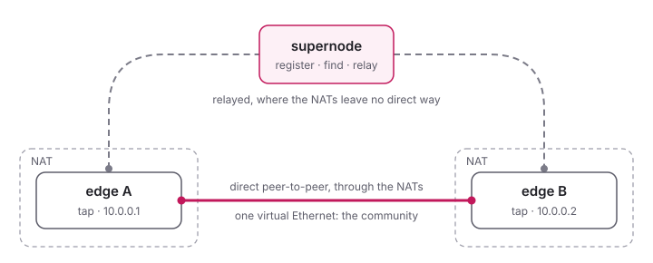

<!--
SPDX-License-Identifier: GPL-3.0-only
SPDX-FileCopyrightText: Copyright 2022 n2n contributors
SPDX-FileCopyrightText: Copyright Hamish Coleman
SPDX-FileCopyrightText: Copyright Honey Bunny QT
-->

# n3n BE (Bunny Edition)

[](https://github.com/HoneyBunnyQT/n3n/actions/workflows/quick.yml)
[](https://github.com/HoneyBunnyQT/n3n/actions/workflows/netns.yml)
[](https://github.com/HoneyBunnyQT/n3n/actions/workflows/sanitizers.yml)
[](https://github.com/HoneyBunnyQT/n3n/actions/workflows/interop.yml)
[](LICENSE.md)

A lightweight peer-to-peer VPN: computers anywhere become one virtual
Ethernet network, a _community_, and reach each other directly wherever
their NATs let them - and through a supernode where they do not.



- An **edge** joins a community with a virtual network device (TAP, or TUN)
  and an address in it; what it sends is encrypted with the community's
  key, which a supernode does not need to relay it.
- A **supernode** is where the edges register and find each other, and it
  relays what cannot go directly.  One supernode serves many communities,
  and supernodes federate.  A supernode can be an edge of its own as well.

Both are one program, `n3n`, installed also as `n3n-edge` and
`n3n-supernode`.

## The Bunny Edition

n3n BE is a special edition of [n3n](https://github.com/n42n/n3n), which
grew out of [n2n](https://github.com/ntop/n2n).  It speaks their protocol -
its edges and supernodes work together with those of n3n and of n2n 3.x -
and adds a good deal on top:

- **More NATs get through:** each edge tells the class of its NAT, and
  guesses the ports of a peer behind a hard (symmetric) NAT, with a pool of
  sockets for the peer to meet
- **Networks change:** IPv6 next to IPv4, roaming from one network to
  another without losing the peers, TCP when UDP is blocked and back
- **Faster:** packet threads, and datagrams sent and received several at a
  time - up to a third more throughput for small packets
- **Easier to run:** reload on SIGHUP, systemd notify and watchdog, a
  management page, communities in the configuration file
- **More places:** TUN mode, and an [Android app](https://github.com/HoneyBunnyQT/n3n/tree/main/android)

Experimental in what it tries, not in how it is tested: every push runs
dozens of NAT scenarios in network namespaces, the same under the
sanitizers, and interop tests with the last releases of n3n and n2n (see
[Testing](develop/testing.md)).

## Building

```sh
./autogen.sh && ./configure && make
make test
```

See [Building from Source](build/index.md) for the options and other
systems.

## Documentation

- [Quick Start](quick_start/Config.md): a first configuration
- [Configuration](configure/index.md), with all the
  [options](configure/Options.md)
- [Advanced Topics](advanced/index.md): NAT traversal, threads, routing,
  bridging, filtering
- [Internals](internals/index.md) and [Developing](develop/index.md), with
  the [Roadmap](develop/Roadmap.md)
- [FAQ](FAQ.md), [Contributing](Contributing.md), [License](LICENSE.md)

The man pages `n3n(8)`, `n3n-edge(8)`, `n3n-supernode(8)` and `n3n(7)` come
with the program.  The documentation is also a website, built with
[MkDocs](https://www.mkdocs.org/): `pip install mkdocs`, then `make docs`
(into `site/`) or `make docs_serve` to read it at http://127.0.0.1:8000.
